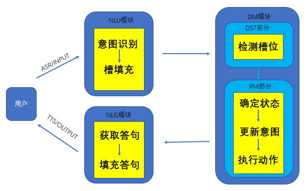
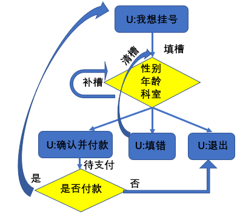

# 基于任务型对话系统的医院自助挂号系统

- [X]  添加介绍和框图（过几天整体整理的时候再加）-22/1/3

# 一，项目介绍

## 1.原理

> 任务型对话系统相较于聊天型目的具体，相较于问答型状态多变，主要由NLU，DM，NLG三个模块组成。 本项目先确定对话流程（对话树），然后进行每个状态的
> 槽、相应、转移状态三个个主要信息分析，通过自定义模板的方式构建医院自助挂号的系统。

## 2.项目结构

```bash
│  chatbot.py  # 聊天机器人程序入口
│  config.py  # 配置文件
│  README.md
│
├─schema
│      qa_states.json  # 医疗知识问答状态模板
│      register_states.json  # 挂号状态模板
│      slot_template.xlsx  # 语义槽模板
│
└─src
        dst.py  # 聊天状态跟踪类脚本，用于判断槽是否填充完毕
        loader.py  # 加载schema中的模板文件
        nlg.py  # 语言生成类，用于生成当前状态下对应的引导交流语句
        nlu.py  # 语言理解类，用于意图识别和语义槽获取
        pm.py  # 决策类，根据dst获取的状态进行决策
```

## 3.对话系统框架与对话树展示

> 对话系统



> 对话树



# 二，项目使用

## 1、下载

`git clone git@github.com:eat-or-eat/chatbot-on-registration.git`

## 2、更换自己的问答模式，仿照schema进行编辑替换

## 3.运行

`python chatbot.py`

运行示例1（正常流程）：

```bash

--------------------
        欢迎使用医院自助问答系统系统
           请问您想做些什么呢？
           1.挂号（输入提示：我想挂号）
           2.问些医学问题（目前未添加的功能）
请您输入:>? 我想挂号
--------------------
请问您的性别为？（输入提示:：男，女）
请您输入:>? 男
--------------------
请问您的年龄为？（输入提示:小写数字）
请您输入:>? 22
--------------------
请问您想去的科室为？（输入提示:内科|外科|辅助科|预防保健科）
请您输入:>? 外壳
--------------------
请问您想去的科室为？（输入提示:内科|外科|辅助科|预防保健科）
请您输入:>? 外科
--------------------
系统消息:好的，请确认您的信息：性别:男;年龄:22;外科（输入提示:确认并支付|信息有误）
请您输入:>? 确认
--------------------
请问您的支付方式为？（输入提示:微信|支付宝|银行卡）
请您输入:>? 微信
--------------------
系统指令: 一个支付二维码链接:https://www.yourip.com/your_info&挂号费
系统消息:请支付X元挂号费，支付后请刷新（输入提示:”刷新“）
请您输入:>? 刷新
--------------------
系统指令: 信息录入挂号系统:https://www.yourip.com/your_info&挂号号码
系统消息:您的排队号码为xx号,祝您身体健康,万事如意
本轮挂号对话结束，欢迎下次使用

```

运行实例2（填错或者不付挂号费退出等流程）：

```bash
--------------------
        欢迎使用医院自助问答系统系统
           请问您想做些什么呢？
           1.挂号（输入提示：我想挂号）
           2.问些医学问题（目前未添加的功能）
请您输入:>? 挂号
--------------------
请问您的性别为？（输入提示:：男，女）
请您输入:>? 男
--------------------
请问您的年龄为？（输入提示:小写数字）
请您输入:>? 12
--------------------
请问您想去的科室为？（输入提示:内科|外科|辅助科|预防保健科）
请您输入:>? 内科
--------------------
系统消息:好的，请确认您的信息：性别:男;年龄:12;内科（输入提示:确认并支付|信息有误|退出）
请您输入:>? 信息有误
--------------------
系统指令: CLEAN_SLOT
系统消息:好的，为您清楚当前信息，请重新输入挂号信息（输入提示:性别、年龄、科室|退出）
请您输入:>? 女12内科
--------------------
系统消息:好的，请确认您的信息：性别:女;年龄:12;内科（输入提示:确认并支付|信息有误|退出）
请您输入:>? 确认
--------------------
请问您的支付方式为？（输入提示:微信|支付宝|银行卡）
请您输入:>? 微信
--------------------
系统指令: 一个支付二维码链接:https://www.yourip.com/your_info&挂号费
系统消息:请支付X元挂号费，支付后请刷新（输入提示:刷新|退出）
请您输入:>? 退出
--------------------
系统指令: 删除个人挂号暂存信息:https://www.yourip.com/your_info&删除信息
系统消息:好的,祝您身体健康,万事如意
本轮挂号对话结束，欢迎下次使用
```
